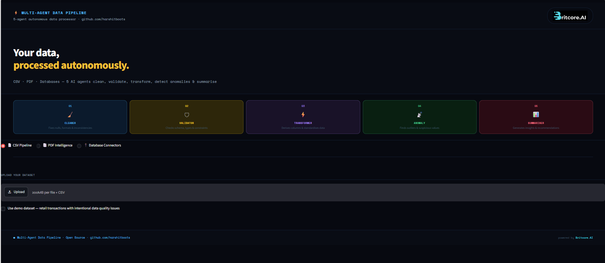
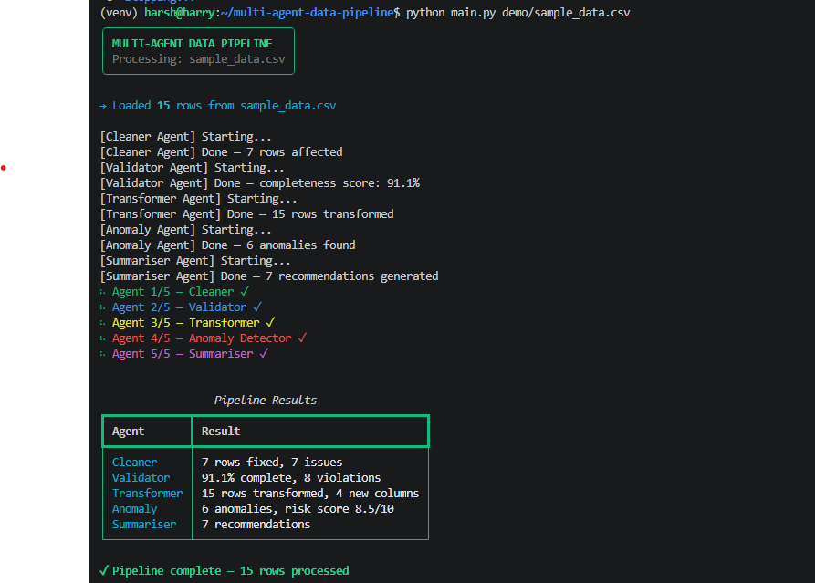
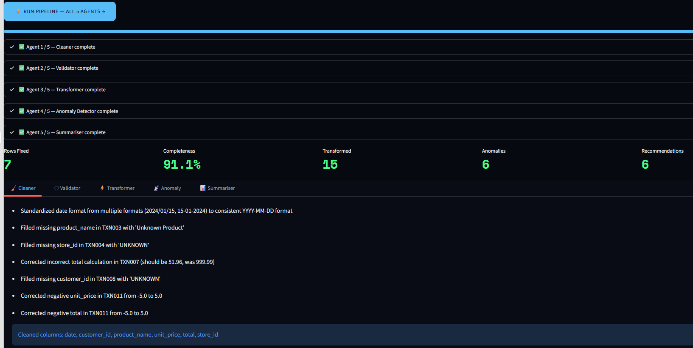
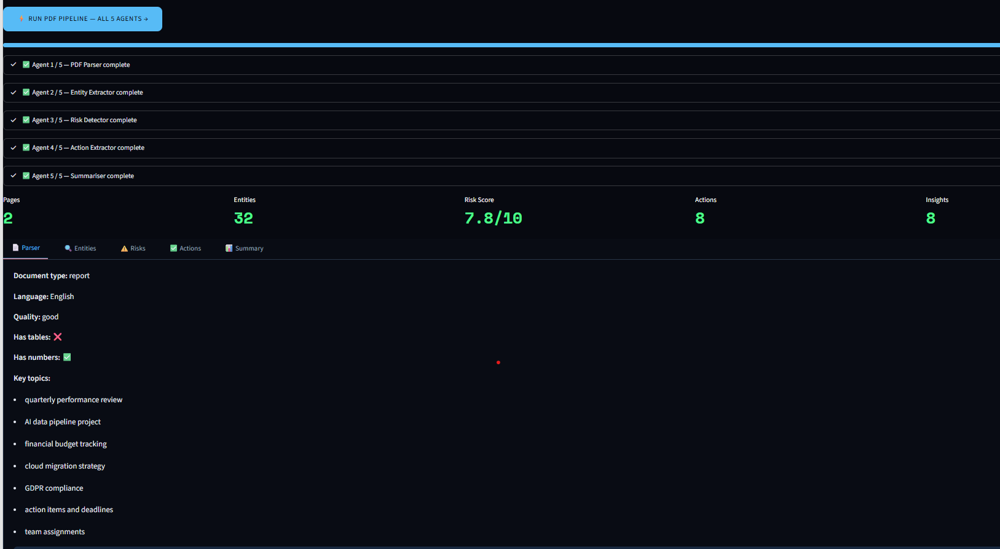
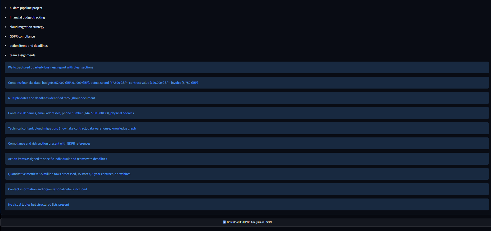
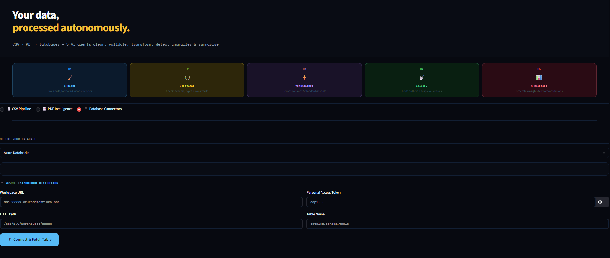
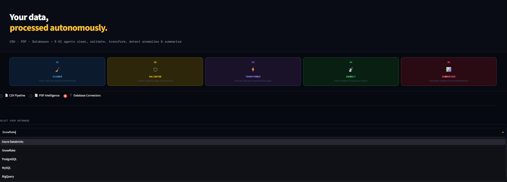

<div align="center">


<br/>
<br/>

# Multi-Agent Data Pipeline

### 5 specialised AI agents that autonomously process any data source

<br/>

[](https://python.org)
[](https://anthropic.com)
[](https://streamlit.io)
[](LICENSE)
[](https://github.com/harshitboots/multi-agent-data-pipeline/stargazers)
[](https://github.com/harshitboots/multi-agent-data-pipeline/network)

<br/>

**[🚀 Quick Start](#quick-start) · [🎬 Demo](#demo) · [📖 How It Works](#how-it-works) · [🔌 Connectors](#data-sources) · [🤝 Contributing](#contributing)**

<br/>

> *Upload a messy CSV, a complex PDF, or connect your database —*
> *watch 5 AI agents autonomously clean, validate, transform,*
> *detect anomalies and summarise your data in real time.*

<br/>

<!-- SCREENSHOT: Take a full browser screenshot of your app homepage (dark theme, all 5 agent cards visible) and save as docs/screenshots/hero.png -->


</div>

---

## The Problem

Every data team has the same nightmare.

You get a CSV from a stakeholder. It has:
- Dates in 3 different formats
- Missing customer IDs on 20% of rows
- A price of £999.99 that should be £9.99
- Column names that change every month
- No documentation. No schema. No context.

You spend **3 hours** writing cleaning scripts.
Then the next file arrives and breaks everything.

**There has to be a better way.**

---

### The Solution

Instead of writing rules, deploy agents.

Each agent has a single job, its own reasoning, and structured output.
They run sequentially, passing context to each other.
The result is a complete data quality report — in seconds.

                  Your messy data
                          ↓
┌─────────────────────────────────────────────────────────────┐
│                                                             │
│   🧹 Cleaner    →    🛡 Validator    →    ⚡ Transformer   │
│                                                             │
│              📡 Anomaly Detector    →    📊 Summariser     │
│                                                             │
└─────────────────────────────────────────────────────────────┘
                           ↓
     Clean data + Full quality report + Business insights

No config files. No rigid schemas. No rules to write and maintain.

Just point it at your data and watch it work.

---

## Quick Start

### Prerequisites

- Python 3.10+
- An Anthropic API key — get one free at [console.anthropic.com](https://console.anthropic.com)

---

### 1. Clone the repo

```bash
git clone https://github.com/harshitboots/multi-agent-data-pipeline.git
cd multi-agent-data-pipeline
```

### 2. Create virtual environment

```bash
python3 -m venv venv

# Mac / Linux
source venv/bin/activate

# Windows
venv\Scripts\activate
```

### 3. Install dependencies

```bash
pip install -r requirements.txt
```

### 4. Add your API key

```bash
cp .env.example .env
```

Open `.env` and add your key:

```bash
ANTHROPIC_API_KEY=sk-ant-xxxxxxxxxxxxxxxx
```

### 5. Run the CLI

```bash
python main.py demo/sample_data.csv
```

### 6. Run the UI

```bash
streamlit run app.py
```

Then open [http://localhost:8501](http://localhost:8501)

---

### Install via pip *(coming soon)*

```bash
pip install multi-agent-data-pipeline
multi-agent-pipeline demo/sample_data.csv
```

---

<!-- SCREENSHOT: Take a screenshot of your terminal showing the pipeline running with all 5 agents completing successfully and the results table. Save as docs/screenshots/cli_output.png -->
<div align="center">

<br/>
<em>The CLI in action — 5 agents processing 15 rows in real time</em>
</div>

---

## Demo

### CSV Pipeline

Upload any CSV — the agents find and fix everything automatically.

<!-- SCREENSHOT: In the app, tick "Use demo dataset", click "RUN PIPELINE", wait for all 5 agents to complete, then screenshot the full results section showing the metrics row (5 green numbers) and the tabs below. Save as docs/screenshots/csv_results.png -->
<div align="center">

<br/>
<em>5 agents process 15 retail transactions — 7 anomalies detected, 91% completeness score</em>
</div>

<br/>

### What the agents found in the demo dataset

| Row | Issue | Agent |
|-----|-------|-------|
| TXN002 | Date format `2024/01/15` — inconsistent | 🧹 Cleaner |
| TXN003 | Date format `15-01-2024` — inconsistent | 🧹 Cleaner |
| TXN003 | Missing product name | 🧹 Cleaner |
| TXN004 | Missing store ID | 🛡 Validator |
| TXN007 | Price anomaly — £999.99 for 4 × £12.99 items | 📡 Anomaly |
| TXN008 | Missing customer ID | 🛡 Validator |
| TXN011 | Negative price — `-£5.00` | 📡 Anomaly |

<br/>

### PDF Intelligence

Upload any PDF — contracts, reports, invoices, meeting notes.

<!-- SCREENSHOT: In the app click "PDF Intelligence" tab, tick "Use demo PDF", click "RUN PDF PIPELINE", wait for all 5 agents, screenshot the results showing metrics row and tabs. Save as docs/screenshots/pdf_results.png -->
<div align="center">
<
<br/>

<br/>
<em>PDF agents extract entities, detect GDPR risks, and pull action items from a quarterly report</em>
</div>

<br/>

### Database Connectors

Connect directly to your database — agents fetch a table and run the full pipeline.

<!-- SCREENSHOT: In the app click "Database Connectors" tab, select "Azure Databricks" from the dropdown, screenshot the connection form. Save as docs/screenshots/connectors.png -->
<div align="center">

<br/>

<br/>
<em>5 database connectors — Azure Databricks, Snowflake, PostgreSQL, MySQL, BigQuery</em>
</div>

---

## How It Works

### Agent Design Philosophy

Each agent is a **specialised Claude AI instance** with:
- A focused system prompt defining its exact role
- A strict JSON output schema enforced by Pydantic
- Graceful error handling with typed fallback responses
- Context passing — each agent knows what the previous one found

No LangChain. No bloated frameworks. Just clean Python and direct API calls.

---

### The 5 CSV Pipeline Agents

#### 🧹 Agent 1 — Cleaner
Identifies and fixes data quality issues before anything else runs.

```python
# What it finds
{
    "issues_fixed": [
        "Inconsistent date formats — standardised to YYYY-MM-DD",
        "Missing product names — flagged 1 row",
        "Missing store IDs — flagged 1 row"
    ],
    "rows_affected": 6,
    "cleaned_columns": ["date", "product_name", "store_id"]
}
```

#### 🛡 Agent 2 — Validator
Checks schema correctness, data types, constraints and completeness.

```python
{
    "schema_ok": true,
    "violations": [
        "Missing customer_id in rows 8",
        "Negative unit_price in row 11"
    ],
    "passed_checks": [
        "All transaction IDs unique",
        "Quantity values positive"
    ],
    "completeness_score": 91.1
}
```

#### ⚡ Agent 3 — Transformer
Standardises, normalises and derives new columns from existing data.

```python
{
    "transformations_applied": [
        "Standardised all dates to ISO 8601",
        "Normalised product names to title case"
    ],
    "new_columns": ["year", "month", "day_of_week", "price_band", "is_weekend"],
    "rows_transformed": 15
}
```

#### 📡 Agent 4 — Anomaly Detector
Finds statistical outliers, impossible values and suspicious patterns.

```python
{
    "anomalies": [
        "TXN007: total £999.99 — expected ~£51.96 for 4 × £12.99",
        "TXN011: negative unit_price -£5.00 — impossible value"
    ],
    "anomaly_count": 7,
    "anomaly_score": 8.5,
    "flagged_rows": [7, 11]
}
```

#### 📊 Agent 5 — Summariser
Produces a business-readable summary with key stats and recommendations.

```python
{
    "summary": "Dataset contains 15 retail transactions across 5 categories...",
    "key_stats": {
        "Total Revenue": "£413.56",
        "Top Category": "Skincare",
        "Date Range": "15–20 Jan 2024"
    },
    "recommendations": [
        "Investigate TXN007 — possible data entry error",
        "Standardise date format across all upstream systems"
    ]
}
```

---

### The 5 PDF Intelligence Agents

| Agent | Input | Output |
|-------|-------|--------|
| **📄 PDF Parser** | Raw PDF text | Document type, language, quality, key topics |
| **🔍 Entity Extractor** | PDF text | People, orgs, dates, amounts, emails, locations |
| **⚠️ Risk Detector** | PDF text | PII flags, GDPR risks, legal/financial red flags |
| **✅ Action Extractor** | PDF text | Todos, decisions, deadlines, owners |
| **📊 Summariser** | All agent context | Business summary + recommendations |

---

### Architecture

multi-agent-data-pipeline/
├── src/
│   ├── agents/
│   │   ├── cleaner.py           # CSV cleaning agent
│   │   ├── validator.py         # CSV validation agent
│   │   ├── transformer.py       # CSV transformation agent
│   │   ├── anomaly.py           # Anomaly detection agent
│   │   ├── summariser.py        # Summarisation agent
│   │   ├── pdf_parser.py        # PDF parsing agent
│   │   ├── entity_extractor.py  # Entity extraction agent
│   │   ├── risk_detector.py     # Risk detection agent
│   │   └── action_extractor.py  # Action item agent
│   ├── connectors/
│   │   ├── databricks.py        # Azure Databricks
│   │   ├── snowflake_conn.py    # Snowflake
│   │   ├── postgres.py          # PostgreSQL
│   │   ├── mysql.py             # MySQL
│   │   └── bigquery.py          # BigQuery
│   ├── models.py                # Pydantic schemas
│   └── pipeline.py              # Orchestrator
├── demo/
│   ├── sample_data.csv          # Demo CSV with intentional issues
│   └── sample_report.pdf        # Demo PDF quarterly report
├── contrib/
│   ├── azure/                   # Azure deployment guide
│   ├── databricks/              # Databricks implementation
│   ├── aws/                     # AWS Lambda implementation
│   └── docker/                  # Docker deployment
├── tests/
│   └── test_pipeline.py         # 11 passing tests
├── app.py                       # Streamlit UI
├── main.py                      # CLI entrypoint
└── requirements.txt


---

### Sequence Flow

User uploads CSV / PDF / connects DB
↓
Pipeline Orchestrator
↓
┌─────────────────────┐
│   Agent 1: Cleaner  │ ──→ CleanerResult (Pydantic)
└─────────────────────┘
↓
┌──────────────────────┐
│  Agent 2: Validator  │ ──→ ValidatorResult (Pydantic)
└──────────────────────┘
↓
┌────────────────────────┐
│ Agent 3: Transformer   │ ──→ TransformerResult (Pydantic)
└────────────────────────┘
↓
┌──────────────────────────────┐
│ Agent 4: Anomaly Detector    │ ──→ AnomalyResult (Pydantic)
└──────────────────────────────┘
↓
┌─────────────────────────────────────────┐
│ Agent 5: Summariser (with full context) │ ──→ SummariserResult
└─────────────────────────────────────────┘
↓
PipelineResult (combined)
↓
CLI table + JSON export + UI display

---

## Data Sources

### 📄 CSV Upload

Drop any CSV file — no schema required. The agents infer structure, detect issues and process automatically.

```bash
# CLI
python main.py your_data.csv

# With JSON output
python main.py your_data.csv --output results.json
```

Tested with:
- Retail transaction data
- Financial ledgers
- HR records
- IoT sensor readings
- Marketing campaign data
- Any flat file CSV

---

### 📑 PDF Intelligence

Upload any PDF document. Agents extract structured information automatically.

Best results with:
- Quarterly / annual reports
- Contracts and legal documents
- Invoices and purchase orders
- Meeting minutes and notes
- Research papers
- HR documents and policies

---

### 🔌 Database Connectors

Connect directly to your database. Agents fetch any table and run the full pipeline.

#### Azure Databricks

```python
from src.connectors.databricks import fetch_table

df = fetch_table(
    host="adb-xxxxx.azuredatabricks.net",
    token="dapi...",
    http_path="/sql/1.0/warehouses/xxxxx",
    table="catalog.schema.table_name"
)
```

#### Snowflake

```python
from src.connectors.snowflake_conn import fetch_table

df = fetch_table(
    account="xy12345.eu-west-1",
    user="my_user",
    password="my_password",
    database="MY_DATABASE",
    schema="PUBLIC",
    table="MY_TABLE"
)
```

#### PostgreSQL

```python
from src.connectors.postgres import fetch_table

df = fetch_table(
    host="localhost",
    port=5432,
    database="my_database",
    user="postgres",
    password="my_password",
    table="my_table"
)
```

#### MySQL

```python
from src.connectors.mysql import fetch_table

df = fetch_table(
    host="localhost",
    port=3306,
    database="my_database",
    user="root",
    password="my_password",
    table="my_table"
)
```

#### BigQuery

```python
from src.connectors.bigquery import fetch_table

df = fetch_table(
    project_id="my-gcp-project",
    credentials_json=credentials_dict,
    dataset="my_dataset",
    table="my_table"
)
```

---

### Connector Status

| Database | Auth Method | Fetch | Pipeline | Status |
|----------|------------|-------|----------|--------|
| Azure Databricks | PAT Token | ✅ | ✅ | Stable |
| Snowflake | User/Pass | ✅ | ✅ | Stable |
| PostgreSQL | User/Pass | ✅ | ✅ | Stable |
| MySQL | User/Pass | ✅ | ✅ | Stable |
| BigQuery | Service Account JSON | ✅ | ✅ | Stable |
| MongoDB | — | 🔜 | 🔜 | Planned |
| Redshift | — | 🔜 | 🔜 | Planned |
| DuckDB | — | 🔜 | 🔜 | Planned |
| Microsoft Fabric | — | 🔜 | 🔜 | Planned |

> Want to add a connector? See [Contributing](#contributing)

---

## Deploy to Production

This pipeline runs locally out of the box. For production deployment it's compatible with every major cloud platform.

---

### 🐳 Docker

```dockerfile
FROM python:3.12-slim

WORKDIR /app
COPY requirements.txt .
RUN pip install -r requirements.txt

COPY . .

EXPOSE 8501

CMD ["streamlit", "run", "app.py", "--server.port=8501", "--server.address=0.0.0.0"]
```

```bash
docker build -t multi-agent-pipeline .
docker run -p 8501:8501 -e ANTHROPIC_API_KEY=sk-ant-... multi-agent-pipeline
```

---

### ☁️ Azure

**Option 1 — Azure Container Apps**
```bash
az containerapp create \
  --name multi-agent-pipeline \
  --resource-group my-rg \
  --image my-registry/multi-agent-pipeline:latest \
  --env-vars ANTHROPIC_API_KEY=sk-ant-...
```

**Option 2 — Azure Databricks Job**
```python
# Run as a Databricks notebook job
# Point pipeline at any Unity Catalog table
# Schedule via ADF pipeline trigger
```

**Option 3 — Azure Functions**
```python
# Trigger on Blob Storage upload
# Process CSV and store results to ADLS
# Integrate with ADF for orchestration
```

---

### ☁️ AWS

**Option 1 — AWS Lambda + S3**
```python
import boto3
from src.pipeline import run_pipeline

def lambda_handler(event, context):
    bucket = event['Records'][0]['s3']['bucket']['name']
    key = event['Records'][0]['s3']['object']['key']
    # Download CSV from S3
    # Run pipeline
    # Store results back to S3
```

**Option 2 — ECS + Fargate**
```bash
# Deploy as a containerised service
# Auto-scale based on queue depth
# Integrate with SQS for async processing
```

---

### ☁️ GCP

**Cloud Run**
```bash
gcloud run deploy multi-agent-pipeline \
  --image gcr.io/my-project/multi-agent-pipeline \
  --platform managed \
  --set-env-vars ANTHROPIC_API_KEY=sk-ant-...
```

---

### 🚀 Render / Railway (Free Tier)

One-click deploy — zero infrastructure setup.

**Render:**
1. Fork this repo
2. Connect to Render
3. Set `ANTHROPIC_API_KEY` environment variable
4. Deploy — live URL in 2 minutes

**Railway:**
```bash
railway login
railway init
railway up
```

---

### Environment Variables

| Variable | Required | Description |
|----------|----------|-------------|
| `ANTHROPIC_API_KEY` | ✅ Yes | Your Anthropic API key |
| `DATABRICKS_HOST` | Optional | Databricks workspace URL |
| `DATABRICKS_TOKEN` | Optional | Databricks PAT token |
| `SNOWFLAKE_ACCOUNT` | Optional | Snowflake account identifier |
| `POSTGRES_HOST` | Optional | PostgreSQL host |
| `MYSQL_HOST` | Optional | MySQL host |

> See `.env.example` for the full list

---

### Community Cloud Implementations

See the `contrib/` folder for community-contributed cloud implementations:

| Folder | Contents |
|--------|---------|
| `contrib/azure/` | ADF trigger + Databricks job implementation |
| `contrib/databricks/` | Full Databricks notebook implementation |
| `contrib/aws/` | Lambda + S3 trigger implementation |
| `contrib/docker/` | Production Docker + compose setup |

> These are contributed by the community. Want to add yours? See [Contributing](#contributing)

---

## Contributing

This repo is built for the community. Every contribution makes it better for thousands of data engineers.

**Current contributors:** 1 — be the second.

---

### Ways to Contribute

#### 🔌 Add a Database Connector
We want to support every major database. Next targets:

| Database | Difficulty | Issue |
|----------|-----------|-------|
| MongoDB | Medium | #1 |
| Redshift | Easy | #2 |
| DuckDB | Easy | #3 |
| Microsoft Fabric | Medium | #4 |
| Elasticsearch | Hard | #5 |

#### ☁️ Cloud Implementations
Deploy this on your cloud and contribute the implementation:

- `contrib/azure/` — ADF pipeline trigger
- `contrib/databricks/` — Full Databricks notebook
- `contrib/aws/` — Lambda + S3 trigger
- `contrib/docker/` — Production Docker setup
- `contrib/gcp/` — Cloud Run deployment

#### 🤖 New Agents
Ideas for new agents:

- **Schema Inferencer** — auto-detect and document schema
- **PII Anonymiser** — mask sensitive data automatically
- **Data Lineage Tracker** — track where each column came from
- **Duplicate Detector** — find near-duplicate records
- **Language Translator** — translate non-English data fields

#### 🌍 Language Wrappers
Wrap the CLI for other languages:

- R package
- Node.js SDK
- Julia package

#### 📝 Documentation & Examples
- Add example notebooks
- Write tutorials
- Translate docs

---

### Getting Started

```bash
# 1. Fork the repo on GitHub

# 2. Clone your fork
git clone https://github.com/YOUR_USERNAME/multi-agent-data-pipeline.git
cd multi-agent-data-pipeline

# 3. Create virtual environment
python3 -m venv venv
source venv/bin/activate

# 4. Install dependencies
pip install -r requirements.txt

# 5. Create a branch
git checkout -b feature/mongodb-connector

# 6. Make your changes

# 7. Run tests — all must pass
pytest tests/ -v

# 8. Push and open a PR
git push origin feature/mongodb-connector
```

---

### Contribution Guidelines

- One feature per PR
- All tests must pass
- Add tests for new features
- Follow existing code style — each agent has the same structure
- Update README if adding a connector or agent

---

### Adding a New Connector

Follow this pattern — every connector has the same 3 functions:

```python
# src/connectors/your_db.py

def connect(host: str, port: int, database: str, user: str, password: str):
    # Return a connection object
    pass

def list_tables(host: str, ...) -> list:
    # Return list of table names
    pass

def fetch_table(host: str, ..., table: str, limit: int = 1000) -> pd.DataFrame:
    # Return a pandas DataFrame
    pass
```

Then add it to the UI in `app.py` under the Database Connectors section.

---

### Adding a New Agent

Follow this pattern — every agent has the same structure:

```python
# src/agents/your_agent.py

SYSTEM_PROMPT = """You are a [role] agent.
Respond ONLY with valid JSON. No markdown. No explanation.
JSON format: { ... }"""

class YourAgentResult:
    def __init__(self, **kwargs): ...
    def model_dump(self): return self.__dict__

def run(data: str, context: int) -> YourAgentResult:
    response = client.messages.create(...)
    # parse and return typed result
```

---

### Recognition

All contributors are:
- Listed in the README contributors section
- Credited in the release notes
- Mentioned in the Medium article series

---

### Contributors

| Avatar | Name | Contribution |
|--------|------|-------------|
| 👤 | [Harshit Tripathi](https://github.com/harshitboots) | Creator & maintainer |
| 👤 | *Your name here* | *Your contribution* |

---

## Running Tests

```bash
pytest tests/ -v
```
tests/test_pipeline.py::TestModels::test_cleaner_result_creation PASSED
tests/test_pipeline.py::TestModels::test_validator_result_creation PASSED
tests/test_pipeline.py::TestModels::test_transformer_result_creation PASSED
tests/test_pipeline.py::TestModels::test_anomaly_result_creation PASSED
tests/test_pipeline.py::TestModels::test_summariser_result_creation PASSED
tests/test_pipeline.py::TestModels::test_pipeline_result_creation PASSED
tests/test_pipeline.py::TestCSVLoading::test_csv_loads_correctly PASSED
tests/test_pipeline.py::TestCSVLoading::test_csv_preview_generation PASSED
tests/test_pipeline.py::TestCSVLoading::test_demo_csv_exists PASSED
tests/test_pipeline.py::TestCSVLoading::test_demo_csv_has_correct_columns PASSED
tests/test_pipeline.py::TestCSVLoading::test_demo_csv_has_rows PASSED
11 passed in 0.42s

---

---

## Tech Stack

| Layer | Technology |
|-------|-----------|
| AI | Anthropic Claude (claude-sonnet-4-5) |
| Language | Python 3.12 |
| Data | Pandas, PyPDF |
| Validation | Pydantic v2 |
| CLI | Typer + Rich |
| UI | Streamlit |
| Connectors | Databricks SDK, Snowflake, psycopg2, mysql-connector, BigQuery |
| Testing | pytest |
| Packaging | pyproject.toml |

---

## Roadmap

- [x] CSV pipeline — 5 agents
- [x] PDF intelligence — 5 agents
- [x] Database connectors — 5 databases
- [x] Streamlit UI — dark theme
- [x] CLI entrypoint
- [x] JSON export
- [ ] pip package — `pip install multi-agent-data-pipeline`
- [ ] MongoDB connector
- [ ] Redshift connector
- [ ] DuckDB connector
- [ ] Microsoft Fabric connector
- [ ] Async parallel agent execution
- [ ] Agent memory — learn from past runs
- [ ] Webhook support — trigger via HTTP
- [ ] REST API — FastAPI wrapper
- [ ] Docker image on Docker Hub
- [ ] GitHub Actions CI/CD

---

## About

Built by **Harshit Tripathi** — Lead Data Engineer

- Creator of **ATLAS Knowledge Graph** — AI-powered data lineage and discovery platform on Azure Databricks
- 10 years of experience across Azure, Databricks, PySpark, Unity Catalog, Microsoft Fabric
- Databricks Certified Professional
- Cross-industry background — retail, aerospace, healthcare

This project is part of the **Britcore.AI open source initiative** — building practical AI tools for data engineers.

| | |
|--|--|
| 🌐 Website | [britcore.ai](https://britcore.ai) |
| 🐙 GitHub | [github.com/harshitboots](https://github.com/harshitboots) |
| 💼 LinkedIn | [linkedin.com/in/harshittripathi](https://linkedin.com/in/harshittripathi) |

---

## License

MIT License — free to use, modify and distribute.

See [LICENSE](LICENSE) for full terms.

---

<div align="center">


<br/>
<br/>

### If this tool saved you time or taught you something new

# ⭐ Star the repo

*It takes 2 seconds and helps thousands of data engineers find this tool.*

<br/>

[](https://github.com/harshitboots/multi-agent-data-pipeline/stargazers)

<br/>

**Built with Claude AI · Powered by Britcore.AI · Made with ❤️ for the data engineering community**

</div>


